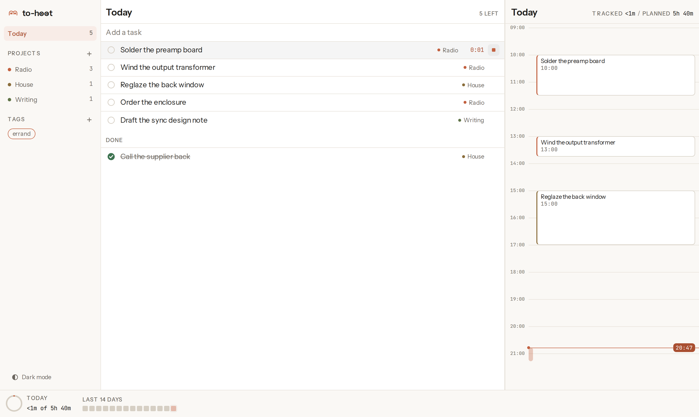
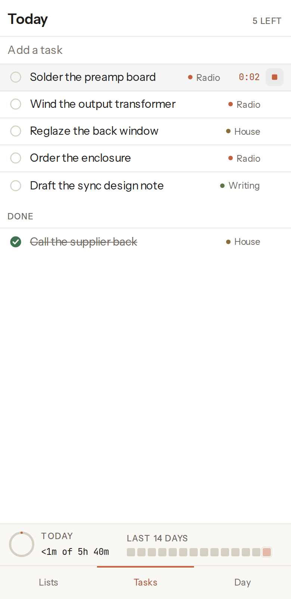

# to-hoot

<picture>
  <source media="(prefers-color-scheme: dark)" srcset="docs/img/desktop-dark.png">
  
</picture>

A task list that tracks time against the day you actually had. One list on your
Linux desktop and your Android phone, synced through a private GitHub repository
you own, with your real calendar beside it and the whole thing reachable from
Claude.

Project site: <https://danieltyukov.github.io/to-hoot/>

## What it is

`packages/ui` is the entire application, a React app that runs unchanged in
three places: a Tauri window on the desktop, a Capacitor WebView on Android, and
a plain browser under test. The desktop and mobile targets are shells that
supply one platform adapter each, which is what makes a single design pass cover
both.

The datastore is a private GitHub repository holding an append-only event log
plus a snapshot. Every device writes only under its own `events/<deviceId>/`
prefix, so two devices never write the same path and merging is replay rather
than reconciliation. Time is recorded as increments, not totals, so two devices
tracking the same task at once produce a sum instead of one overwriting the
other. `docs/ARCHITECTURE.md` describes the model in full, because anyone
running this is storing their own data and should be able to audit it.

The calendar layer is a Google Apps Script web app you deploy to your own
account. It reads your calendars and writes tracked time back to a separate
"to-hoot log" calendar, never to your real ones.

The Claude layer is an MCP server offering nine tools over the same event log:
`list_tasks`, `search_tasks`, `today`, `add_task`, `update_task`,
`complete_task`, `start_timer`, `stop_timer` and `log_time`. A change made by
Claude is indistinguishable from one made in the app.



## What it costs

Nothing, with no payment method anywhere in the stack. Every service hard-fails
rather than billing.

| Service | What it does here | Free tier | At the limit |
|---|---|---|---|
| GitHub Free | Holds your private data repository | Unlimited private repositories | 403 with `Retry-After` |
| GitHub Actions | Builds the releases | Free and unmetered on public repositories, standard runners | n/a |
| GitHub Releases | Hosts the downloads | Unmetered bandwidth, 2 GiB per file | n/a |
| Apps Script and Calendar API v3 | The calendar bridge | Free, with no Google Cloud billing account | Quota error |
| Cloudflare Workers Free | Optional MCP endpoint for Claude web | 100,000 requests per day on `workers.dev` | HTTP error, never a bill |
| Sideloaded APK | Installing on your phone | No Play Console account | n/a |

There is no paid tier to upgrade to, because there is no hosted service. What
runs is running in your accounts.

## Install

Downloads are on the [releases page](https://github.com/danieltyukov/to-hoot/releases/latest).

**Android.** Download `to-hoot.apk` and open it. Android will ask you to allow
installs from your browser, once. The APK is signed with a key that is not
Google's, so an update installs over the top only if it came from the same
place.

**Linux.** `to-hoot_x86_64.AppImage` runs anywhere: `chmod +x` it and run it.
`to-hoot_amd64.deb` is there for Debian and Ubuntu, installed with
`sudo apt install ./to-hoot_amd64.deb`. Both are built on Ubuntu 22.04 so they
run on older systems as well as newer ones.

If the desktop window opens blank on NVIDIA hardware, export
`__NV_DISABLE_EXPLICIT_SYNC=1` before launching. The installed `.desktop` entry
already sets it; running the binary directly does not.

Everything works with no accounts at all. Sync, calendar and Claude are added
later from Settings, and each one is optional. `docs/SETUP.md` is the long-form
version of the in-app wizard.

## Build from source

Requires Node 22 and npm 10 or newer.

```
git clone https://github.com/danieltyukov/to-hoot.git
cd to-hoot
npm ci
npm test
npm run build
```

That builds the web application into `packages/ui/dist`. The two shells are
deliberately not npm workspaces, because the Tauri and Capacitor CLIs both want
a flat `node_modules`:

```
cd apps/desktop && npm install && npm run build     # deb and AppImage
cd apps/mobile  && npm install && npm run apk:debug # debug APK, self-signed
```

The desktop build needs the WebKitGTK toolchain; the exact package list is in
`CONTRIBUTING.md`. No keystore is needed to build: debug builds sign themselves,
and a release build with no signing material stays unsigned rather than failing.

## Repository layout

    packages/core/     models, event log, merge, tick. No DOM.
    packages/ui/       React 19 and Vite. The entire application.
    apps/desktop/      Tauri 2 shell, produces the AppImage and the deb
    apps/mobile/       Capacitor 8 shell, produces the APK
    apps/mcp/          stdio MCP server for Claude Code
    apps/worker/       Cloudflare Worker, remote MCP for Claude web
    apps/apps-script/  the Google Calendar bridge
    site/              the one-page project site
    docs/              SETUP and ARCHITECTURE

## Documentation

- `docs/SETUP.md`, connecting sync, calendar and Claude to your own accounts.
- `docs/ARCHITECTURE.md`, the event log, the merge rules and the sync protocol.
- `CONTRIBUTING.md`, how to run each target and each test suite.
- `SECURITY.md`, where tokens live and how to report a problem.

## Licence

MIT, in `LICENSE`. The three bundled fonts are OFL 1.1 subsets of Instrument
Sans, Newsreader and JetBrains Mono, each shipping its upstream notice beside
the file.
